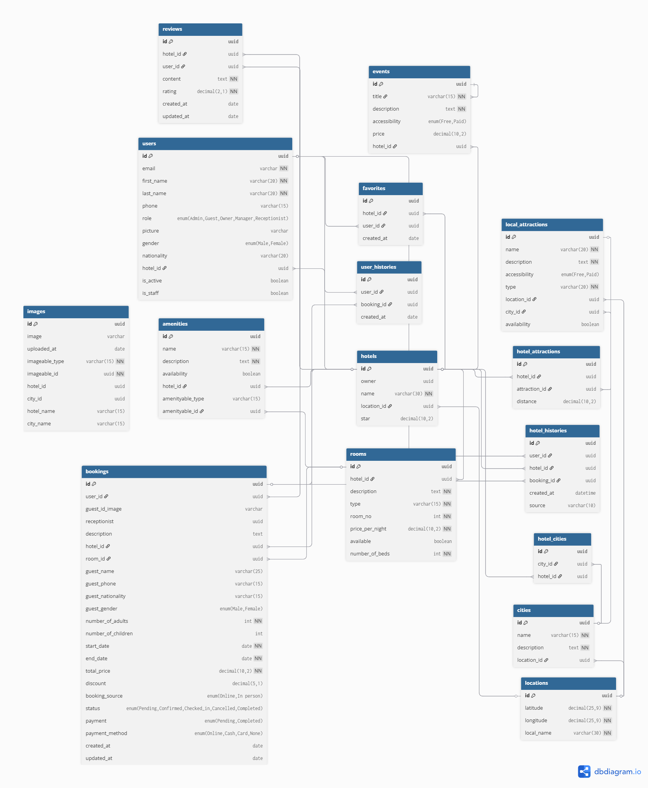

# GuzoMate Hotel Booking System Database Design

## Overview

This document describes the database schema for the GuzoMate Hotel Booking and Management System.  
It is designed to support user management, hotel management, bookings, reviews, amenities, events, images, locations, local attractions, cities, and user interaction history.

The schema integrates all apps: **Accounts**, **Hotel**, and **Business**.

---

## 1. Accounts

### 1.1 User

Stores information about all users, including guests, owners, and staff.

| Field      | Type                                           | Notes/Constraints                           |
|------------|-----------------------------------------------|--------------------------------------------|
| id         | uuid [pk]                                     | Primary key, default UUID                  |
| email      | varchar                                       | Unique, required, used as username        |
| first_name | varchar(20)                                   | Required                                   |
| last_name  | varchar(20)                                   | Required                                   |
| phone      | varchar(15)                                   | Unique, optional                           |
| role       | enum("Admin","Guest","Owner","Manager","Receptionist") | Default="Guest"                            |
| picture    | image                                         | Optional, uploaded via custom path        |
| gender     | enum("Male","Female")                         | Default="Male"                             |
| nationality| varchar(20)                                   | Default="Ethiopian"                        |
| hotel      | uuid [fk: Hotel.id]                           | Nullable, FK if user is hotel staff       |
| is_active  | bool                                          | Default=True                               |
| is_staff   | bool                                          | Default=False                              |

---

## 2. Hotel App

### 2.1 Location

Represents geographic coordinates and local area names.

| Field      | Type                   | Notes/Constraints             |
|------------|------------------------|-------------------------------|
| id         | uuid [pk]              | Primary key, default UUID     |
| latitude   | decimal(25,9)          | Required, unique with longitude |
| longitude  | decimal(25,9)          | Required, unique with latitude |
| local_name | varchar(30)            | Required                      |

### 2.2 Hotel

Stores basic hotel information.

| Field    | Type                 | Notes/Constraints                 |
|----------|--------------------|----------------------------------|
| id       | uuid [pk]           | Primary key, default UUID        |
| owner    | uuid                | FK to User (owner)               |
| name     | varchar(30)         | Required, indexed                |
| location | uuid [fk: Location.id]| OneToOne, nullable              |
| star     | decimal(10,2)       | Nullable                         |

### 2.3 Room

Stores details about rooms in hotels.

| Field           | Type                 | Notes/Constraints                   |
|-----------------|--------------------|------------------------------------|
| id              | uuid [pk]           | Primary key, default UUID          |
| hotel           | uuid [fk: Hotel.id] | Required, related_name="rooms"     |
| description     | text                | Required                           |
| type            | varchar(15)         | Required, indexed                  |
| room_no         | integer             | Required, unique per hotel         |
| price_per_night | decimal(10,2)       | Required, indexed                  |
| available       | bool                | Default=True, indexed              |
| number_of_beds  | integer             | Required                           |

### 2.4 Amenities

Stores amenities for hotels and rooms.

| Field            | Type                 | Notes/Constraints                  |
|------------------|--------------------|-----------------------------------|
| id               | uuid [pk]           | Primary key, default UUID         |
| name             | varchar(15)         | Required, indexed                 |
| description      | text                | Required                          |
| availability     | bool                | Default=True                       |
| hotel            | uuid [fk: Hotel.id] | Required, related_name="amenities"|
| amenityable_type | varchar(15)         | Default="Hotel"                   |
| amenityable_id   | uuid [fk: Room.id]  | Optional, relates amenity to a room |

### 2.5 Event

Represents events and activities at hotels.

| Field        | Type                 | Notes/Constraints                |
|--------------|--------------------|---------------------------------|
| id           | uuid [pk]           | Primary key, default UUID       |
| title        | varchar(15)         | Required, indexed               |
| description  | text                | Required                        |
| accessibility| enum("Free","Paid") | Default="Free"                  |
| price        | decimal(10,2)       | Default=0.00                    |
| hotel        | uuid [fk: Hotel.id] | Required, related_name="events" |

### 2.6 HotelAttraction

Links hotels to nearby local attractions.

| Field       | Type                     | Notes/Constraints                |
|-------------|--------------------------|---------------------------------|
| id          | uuid [pk]               | Primary key, default UUID       |
| hotel       | uuid [fk: Hotel.id]      | Required, related_name="hotel_attractions" |
| attraction  | uuid [fk: LocalAttraction.id] | Required, related_name="attraction_hotels" |
| distance    | decimal(10,2)           | Default=0.00                     |

### 2.7 Image

Polymorphic table for storing images linked to different entities.

| Field          | Type                 | Notes/Constraints                   |
|----------------|--------------------|------------------------------------|
| id             | uuid [pk]           | Primary key, default UUID           |
| image          | image               | Optional, uploaded via dynamic path |
| uploaded_at    | date                | Auto-add                            |
| imageable_type | varchar(15)         | Entity type (Hotel, Room, City, etc.) |
| imageable_id   | uuid                | Related entity ID                   |
| hotel          | uuid                | Optional, for queries               |
| city           | uuid                | Optional, for queries               |
| hotel_name     | varchar(15)         | Optional folder/path info           |
| city_name      | varchar(15)         | Optional folder/path info           |

---

## 3. Business App

### 3.1 Review

Stores user reviews for hotels.

| Field      | Type                 | Notes/Constraints                 |
|------------|--------------------|----------------------------------|
| id         | uuid [pk]           | Primary key, default UUID        |
| hotel      | uuid [fk: Hotel.id] | Required, related_name="ratings"|
| user       | uuid [fk: User.id]  | Required, related_name="reviews"|
| content    | text                | Required                         |
| rating     | decimal(2,1)        | Validators 0–5                   |
| created_at | date                | Auto-add                         |
| updated_at | date                | Auto-update                       |

### 3.2 Booking

Stores booking details for both online and in-person guests.

| Field                | Type                                             | Notes/Constraints                       |
|----------------------|-------------------------------------------------|----------------------------------------|
| id                   | uuid [pk]                                       | Primary key, default UUID               |
| user                 | uuid [fk: User.id]                              | Nullable, online bookings               |
| guest_id_image       | image                                           | Nullable                                |
| receptionist         | uuid                                           | Nullable                                |
| description          | text                                           | Optional                                |
| hotel                | uuid [fk: Hotel.id]                             | Required, related_name="hotel_bookings"|
| room                 | uuid [fk: Room.id]                              | Required, related_name="room_bookings" |
| guest_name           | varchar(25)                                    | Nullable                                |
| guest_phone          | varchar(15)                                    | Nullable                                |
| guest_nationality    | varchar(15)                                    | Default="Ethiopian"                     |
| guest_gender         | enum("Male","Female")                           | Default="Male"                          |
| number_of_adults     | int                                            | Required                                |
| number_of_children   | int                                            | Default=0                               |
| start_date           | date                                           | Required                                |
| end_date             | date                                           | Required                                |
| total_price          | decimal(10,2)                                  | Required                                |
| discount             | decimal(5,1)                                   | Default=0.0                             |
| booking_source       | enum("Online","In person")                      | Default="Online"                        |
| status               | enum("Pending","Confirmed","Checked_in","Cancelled","Completed") | Default="Pending" |
| payment              | enum("Pending","Completed")                    | Default="Pending"                       |
| payment_method       | enum("Online","Cash","Card","None")            | Default="None"                          |
| created_at           | date                                           | Auto-add                                |
| updated_at           | date                                           | Auto-update                             |

### 3.3 UserHistory

Tracks booking history for users.

| Field      | Type                 | Notes/Constraints        |
|------------|--------------------|-------------------------|
| id         | uuid [pk]           | Primary key, default UUID|
| user       | uuid [fk: User.id]  | Required                |
| booking    | uuid [fk: Booking.id]| Required               |
| created_at | date                | Auto-add                |

### 3.4 HotelHistory

Tracks booking history for hotels.

| Field      | Type                 | Notes/Constraints                 |
|------------|--------------------|----------------------------------|
| id         | uuid [pk]           | Primary key, default UUID        |
| user       | uuid [fk: User.id]  | Nullable                         |
| hotel      | uuid [fk: Hotel.id] | Required                         |
| booking    | uuid [fk: Booking.id]| Required                        |
| created_at | datetime            | Auto-add                          |
| source     | varchar(10)         | Booking source (Online/In person)|

### 3.5 Favorite

Tracks users’ favorite hotels.

| Field      | Type                 | Notes/Constraints        |
|------------|--------------------|-------------------------|
| id         | uuid [pk]           | Primary key, default UUID|
| hotel      | uuid [fk: Hotel.id] | Required                |
| user       | uuid [fk: User.id]  | Required                |
| created_at | date                | Auto-add                |

### 3.6 City

Stores city information.

| Field      | Type                 | Notes/Constraints        |
|------------|--------------------|-------------------------|
| id         | uuid [pk]           | Primary key, default UUID|
| name       | varchar(15)         | Required, indexed       |
| description| text                | Required                |
| location   | uuid [fk: Location.id]| Nullable OneToOne       |

### 3.7 LocalAttraction

Stores local attractions in cities.

| Field          | Type                 | Notes/Constraints       |
|----------------|--------------------|------------------------|
| id             | uuid [pk]           | Primary key, default UUID|
| name           | varchar(20)         | Required, indexed      |
| description    | text                | Required               |
| accessibility  | enum("Free","Paid")  | Default="Free"         |
| type           | varchar(20)         | Required, indexed      |
| location       | uuid [fk: Location.id]| Nullable OneToOne      |
| city           | uuid [fk: City.id]   | Required               |
| availability   | bool                | Default=True           |

### 3.8 HotelCities

Links hotels to cities.

| Field      | Type                 | Notes/Constraints        |
|------------|--------------------|-------------------------|
| id         | uuid [pk]           | Primary key, default UUID|
| city       | uuid [fk: City.id]  | Required, related_name="hotels" |
| hotel      | uuid [fk: Hotel.id]  | Required, related_name="cities" |

---

## 🔧 Diagram

---

© 2025 Project Team
