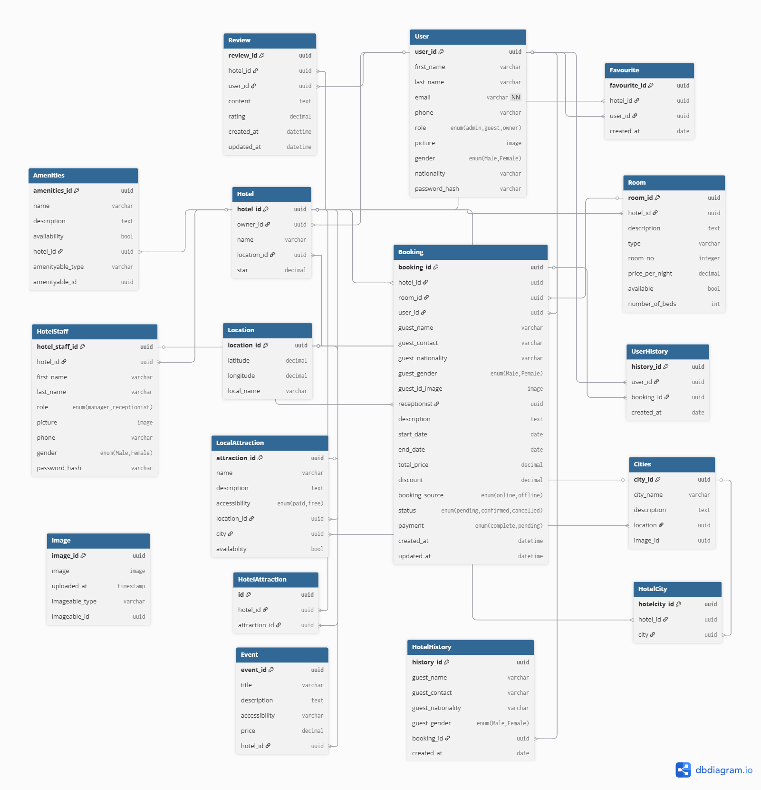

# GuzoMate hotel booking system database design

## Overview

This document describes the database schema design for the Guzomate Hotel booking and managing system. The database is designed to support guest management, hotel information, reviews, reservations, profiles, user interaction history, and more.

---

## Entity Descriptions

### 1. User

Stores information about all users, including admins, guests, and owners.

| Field       | Type                                         |
|-------------|----------------------------------------------|
| user_id     | uuid [pk]                                    |
| first_name  | varchar                                      |
| last_name   | varchar                                      |
| email       | varchar [unique, not null]                   |
| phone       | varchar                                      |
| role        | enum("admin", "guest", "owner")              |
| picture     | image                 |
| gender      | enum('Male', 'Female')                       |
| nationality | varchar                                      |
| password_hash | varchar                                    |

---

### 2. HotelStaff

Links hotel staff members to hotels and their assigned roles.

| Field          | Type                                         |
|----------------|----------------------------------------------|
| hotel_staff_id | uuid [pk]                                    |
| hotel_id       | uuid [ref: > Hotel.hotel_id]                  |
| first_name      | varchar                    |
| last_name      | varchar                    |
| role           | enum('manager', 'receptionist')              |
| picture      | image                    |
| gender   | enum('Male', 'Female')                                   |
| password_hash | varchar                                    |

---

### 3. Location

Represents geographic coordinates and location names.

| Field       | Type     |
|-------------|----------|
| location_id | uuid [pk]|
| latitude    | decimal  |
| longitude   | decimal  |
| local_name  | varchar  |

---

### 4. Hotel

Basic information about hotels.

| Field       | Type                                         |
|-------------|----------------------------------------------|
| hotel_id    | uuid [pk]                                    |
| owner_id    | uuid [ref: > User.user_id]                   |
| name        | varchar                                      |
| location_id | uuid [ref: > Location.location_id]           |
| star        | decimal                                      |

---

### 5. Room

Room details for each hotel.

| Field            | Type                              |
|------------------|-----------------------------------|
| room_id          | uuid [pk]                         |
| hotel_id         | uuid [ref: > Hotel.hotel_id]       |
| description      | text                              |
| type             | varchar                           |
| room_no          | integer                           |
| price_per_night  | decimal                           |
| available        | bool                              |
| number_of_beds   | int                               |

---

### 6. Amenities

Details about hotel amenities.

| Field            | Type                              |
|------------------|-----------------------------------|
| amenities_id     | uuid [pk]                         |
| name             | varchar                           |
| description      | text                              |
| availability     | bool                              |
| hotel_id         | uuid [ref: > Hotel.hotel_id]       |
| amenityable_type | varchar                           |
| amenityable_id   | uuid                              |

---

### 7. Event

Hotel events and activities.

| Field        | Type                              |
|--------------|-----------------------------------|
| event_id     | uuid [pk]                         |
| title        | varchar                           |
| description  | text                              |
| accessibility| varchar                           |
| price        | decimal                           |
| hotel_id     | uuid [ref: > Hotel.hotel_id]       |

---

### 8. LocalAttraction

Local attractions near hotels.

| Field        | Type                                         |
|--------------|----------------------------------------------|
| attraction_id| uuid [pk]                                    |
| name         | varchar                                      |
| description  | text                                         |
| accessibility| enum('paid', 'free')                         |
| location_id  | uuid [ref: > Location.location_id]           |
| city_id  | uuid [ref: > Cities.city_id]           |
| availability | bool                                         |

---

### 9. HotelAttraction

Links hotels to local attractions.

| Field         | Type                                              |
|---------------|---------------------------------------------------|
| id            | uuid [pk]                                         |
| hotel_id      | uuid [ref: > Hotel.hotel_id]                       |
| attraction_id | uuid [ref: > LocalAttraction.attraction_id]        |

---

### 10. Image

Polymorphic table for storing images linked to different entities.

| Field          | Type     |
|----------------|----------|
| image_id       | uuid [pk]|
| image     | image  |
| uploaded_at    | timestamp|
| imageable_type | varchar  |
| imageable_id   | uuid     |

---

### 11. Review

Stores user reviews for hotels.

| Field      | Type                                         |
|------------|----------------------------------------------|
| review_id  | uuid [pk]                                    |
| hotel_id   | uuid [ref: > Hotel.hotel_id]                  |
| user_id    | uuid [ref: > User.user_id]                    |
| content    | text                                         |
| rating     | decimal                                      |
| created_at | datetime                                     |
| updated_at | datetime                                     |

---

### 12. Booking

Stores booking details for both online and offline guests.

| Field           | Type                                         |
|-----------------|----------------------------------------------|
| booking_id      | uuid [pk]                                    |
| hotel_id        | uuid [ref: > Hotel.hotel_id]                  |
| room_id         | uuid [ref: > Room.room_id]                    |
| user_id         | uuid [ref: > User.user_id, null]              |
| guest_name      | varchar                                      |
| guest_contact   | varchar                                      |
| guest_nationality | varchar                                    |
| guest_gender    | enum('Male', 'Female', 'Other')               |
| guest_id_image  | image            |
| receptionist | uuid [ref: > HotleStaff.hotel_staff_id, null]                                  |
| description     | text                                         |
| start_date      | date                                         |
| end_date        | date                                         |
| total_price     | decimal                                      |
| discount        | decimal                                      |
| booking_source  | enum('online', 'offline')                     |
| status          | enum('pending', 'confirmed', 'cancelled')     |
| Payment | enum('complete', 'pending')                                    |
| created_at      | datetime                                     |
| updated_at      | datetime                                     |

---

### 13. UserHistory

Tracks booking history for users and guests.

| Field           | Type                                         |
|-----------------|----------------------------------------------|
| history_id      | uuid [pk]                                    |
| user_id         | uuid [ref: > User.user_id]                    |
| booking_id      | uuid [ref: > Booking.booking_id]              |
| created_at      | date                                         |

---

### 14. HotelHistory

Tracks booking history for users and guests.

| Field           | Type                                         |
|-----------------|----------------------------------------------|
| history_id      | uuid [pk]                                    |
| guest_name      | varchar                                      |
| guest_contact   | varchar                                      |
| guest_nationality | varchar                                    |
| guest_gender    | enum('Male', 'Female')                       |
| booking_id      | uuid [ref: > Booking.booking_id]              |
| created_at      | date  

---

### 15. Favourite

Tracks users' favorite hotels.

| Field        | Type                                         |
|--------------|----------------------------------------------|
| favourite_id | uuid [pk]                                    |
| hotel_id     | uuid [ref: > Hotel.hotel_id]                  |
| user_id      | uuid [ref: > User.user_id]                    |
| created_at   | date                                         |

---

### 16. Cities

City information

| Field        | Type                                         |
|--------------|----------------------------------------------|
| city_id | uuid [pk]                                    |
| city_name     | varchar                 |
| description    | text                   |
| location  | uuid [ref: > Cities.city_id] |

---

### 17. HotelCities

City information

| Field        | Type                                         |
|--------------|----------------------------------------------|
| hotelcity_id | uuid [pk]
| city_id | uuid [ref: > Cities.city_id]                                 |
| hotel_id  | uuid [ref: > Hotel.hotel_id] |

## 🔧 Diagram

---

© 2025 Project Team