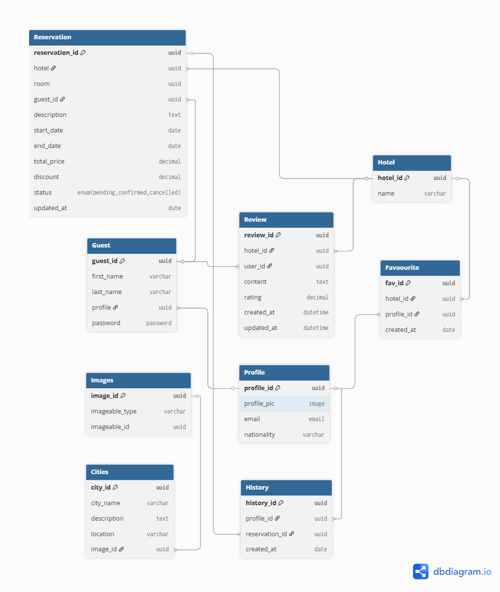

# Booking and Listing System – Database Design Documentation

## Overview

This document describes the database schema design for the Hotel booking api, a core part of the GuzoMate ecosystem. The database is designed to support guest management, hotel information, reviews, reservations, profiles, user interaction history, and so on.

---

## Entity Descriptions
### 1. Reservation

Captures reservation details for a guest at a hotel.

| Field          | Type                                        |
|----------------|---------------------------------------------|
| reservation_id | uuid [pk]                                |
| hotel          | uuid                                        |
| room           | uuid                                        |
| guest_id       | uuid                                        |
| description    | text                                        |
| start_date     | date                                        |
| end_date       | date                                        |
| total_price    | decimal                                     |
| discount       | decimal                                     |
| status         | enum('pending', 'commfirmd', 'canceld')     |
| updated_at     | date                                        |

---

### 2. Guest

Contains information about the user/guest making a reservation.

| Field       | Type       |
|-------------|------------|
| guest_id    | uuid [pk]  |
| first_name  | varchar    |
| last_name   | varchar    |
| profile     | uuid       |
| password    | password   |

---

### 3. Hotel

Basic information about each hotel.

| Field    | Type       |
|----------|------------|
| hotel_id | uuid [pk]  |
| name     | varchar    |

---

### 4. Review

Stores guest reviews for hotels.

| Field      | Type       |
|------------|------------|
| review_id  | uuid [pk]  |
| hotel_id   | uuid       |
| user_id    | uuid       |
| content    | text       |
| rating     | decimal    |
| created_at | datetime   |
| updated_at | datetime   |

---

### 5. Profile

Guest profile data and favorite list reference.

| Field       | Type     |
|-------------|----------|
| profile_id  | uuid [pk]|
| profile_pic | image    |
| email       | email    |
| nationality | varchar  |

---

### 6. Image

Polymorphic image storage for related entities.

| Field           | Type     |
|-----------------|----------|
| image_id        | uuid [pk]|
| imageable_type  | varchar  |
| imageable_id    | uuid     |

---

### 7. City

Defines cities and associates them with image(s).

| Field       | Type      |
|-------------|-----------|
| city_id     | uuid [pk] |
| city_name   | varchar   |
| description | text      |
| location    | varchar   |
| image       | uuid      |

---

### 8. Favorite

Tracks favorite hotels by users.

| Field     | Type      |
|-----------|-----------|
| fav_id    | uuid [pk] |
| profile_id| uuid      |
| hotel_id  | uuid      |
| created_at| date      |

---

### 9. History

Tracks reservation history by profile.

| Field         | Type      |
|---------------|-----------|
| history_id    | uuid [pk] |
| profile_id    | uuid      |
| reservation_id| uuid      |
| created_at    | date      |

---

## 🔧 Diagram

---

© 2025 GuzoMate Project Team