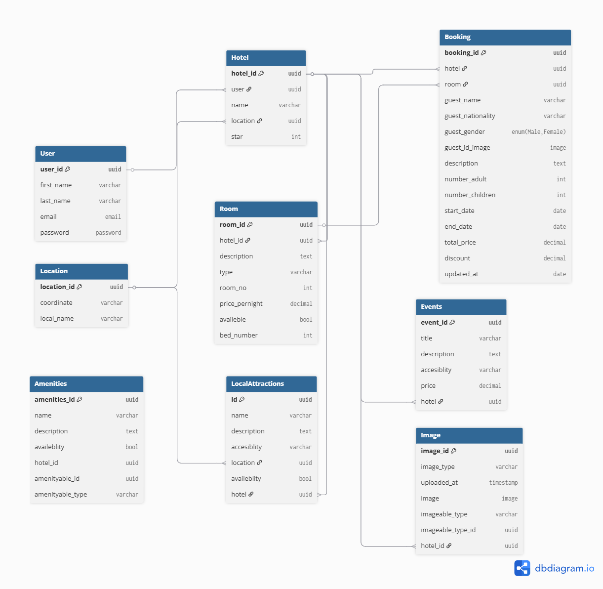

# Hotel Management System – Database Design Documentation

## Overview

This document describes the database schema design for the Hotel Management Service, a core part of the GuzoMate ecosystem. The database is designed to support multi-hotel management, including room listings, bookings (online and in-person), hotel-level and room-level amenities, multimedia content, and local attractions.

## Entity Descriptions

### 1. User

Stores information about hotel owners or administrators.

| Field       | Type       | Description                  |
|-------------|------------|------------------------------|
| user_id     | uuid PK    | Primary key                  |
| first_name  | varchar    | First name of the user       |
| last_name   | varchar    | Last name of the user        |
| email       | email      | Unique email address         |
| password    | password   | Hashed password for authentication |

### 2. Location

Defines physical locations for hotels or attractions.

| Field       | Type       | Description                  |
|-------------|------------|------------------------------|
| location_id | uuid PK    | Primary key                  |
| coordinate  | varchar    | Unique coordinate or map point |
| local_name  | varchar    | Name of the location         |

### 3. Hotel

Each hotel is associated with a user and a location.

| Field       | Type       | Description                  |
|-------------|------------|------------------------------|
| hotel_id    | uuid PK    | Primary key                  |
| user        | uuid FK    | References User.user_id      |
| name        | varchar    | Hotel name                   |
| location    | uuid FK    | References Location.location_id |
| star        | Int        | The star of the hotel        |
### 4. Room

Each room belongs to a specific hotel.

| Field          | Type      | Description                   |
|----------------|-----------|-------------------------------|
| room_id        | uuid PK   | Primary key                   |
| hotel_id       | uuid FK   | References Hotel.hotel_id     |
| description    | text      | Room description              |
| type           | varchar   | Type of room (e.g., deluxe)   |
| room_no        | integer   | Room number                   |
| price_pernight | decimal   | Nightly price                 |
| availeble      | bool      | Availability status           |
| bed_number     | int       | number of beds in the room    |

### 5. Amenities

Polymorphic table for hotel- or room-level amenities.

| Field           | Type      | Description                   |
|-----------------|-----------|-------------------------------|
| amenities_id    | uuid PK   | Primary key                   |
| name            | varchar   | Amenity name                  |
| description     | text      | Amenity details              |
| availeblity     | bool      | Indicates if amenity is currently available |
| hotel_id        | uuid      | Id of related hotel
| amenityable_id  | uuid      | ID of related room or null if it is hotel amenity |
| amenityable_type| varchar   | 'Room' or 'Hotel'             |

### 6. Events

Events hosted by or associated with a hotel.

| Field         | Type      | Description                   |
|---------------|-----------|-------------------------------|
| event_id      | uuid PK   | Primary key                   |
| title         | varchar   | Event title                  |
| description   | text      | Event details                |
| accesiblity   | varchar   | Accessibility type           |
| price         | decimal   | Event price                  |
| hotel         | uuid FK   | References Hotel.hotel_id     |

### 7. Local Attractions

Tourist attractions near hotels.

| Field         | Type      | Description                   |
|---------------|-----------|-------------------------------|
| id            | uuid PK   | Primary key                   |
| name          | varchar   | Attraction name              |
| description   | text      | Description of the attraction |
| accesiblity   | enum      | 'paid' or 'free'             |
| location      | uuid FK   | References Location.location_id |
| availeblity   | bool      | Is currently available?       |
| hotel         | uuid FK   | References Hotel.hotel_id     |

### 8. Image

Polymorphic image storage for multiple models.

| Field           | Type      | Description                   |
|-----------------|-----------|-------------------------------|
| image_id        | uuid PK   | Primary key                   |
| image_type      | varchar   | Type or format of image       |
| uploaded_at     | timestamp | Upload timestamp              |
| image           | image     | Actual image blob or URL (implementation specific) |
| imageable_type  | varchar   | Type of related entity (e.g., Room, Hotel) |
| imageable_type_id | uuid    | UUID of the related entity    |
| hotel_id        | uuid FK   | References Hotel.hotel_id (optional) |

### 9. Booking

Captures both online and in-person booking records.

| Field             | Type      | Description                   |
|-------------------|-----------|-------------------------------|
| booking_id        | uuid PK   | Primary key                   |
| hotel             | uuid FK   | References Hotel.hotel_id     |
| room              | uuid FK   | References Room.room_id       |
| guest_name        | varchar   | Full name of the guest        |
| guest_nationality | varchar   | Nationality of guest          |
| guest_gender      | enum      | 'Male' or 'Female'            |
| guest_id_image    | image     | Guest identification image (optional) |
| description       | text      | Optional booking notes        |
| number_adult      | Int       | Number of adults              |
| number_children   | Int       | Number of children            |
| start_date        | date      | Check-in date                 |
| end_date          | date      | Check-out date                |
| total_price       | decimal   | Final price (before discount) |
| discount          | decimal   | Discount applied              |
| updated_at        | date      | Last update to the booking    |

---

## Note

- All of the IDs used as PK can be changed to customized IDs if needed and the whole DB can be updated as needed.

---

## 🔧 Diagram

---

© 2025 GuzoMate Project Team
