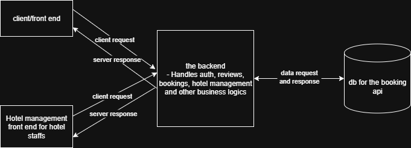

# System Architecture – GuzoMate Platform

## Overview

The GuzoMate platform follows a **three-tier architecture**. The backend (Django) handles user-related features, hotel-related data, bookings, reviews and all other business logics.

---

## Architecture Diagram

## Components

### 1. **Frontend (React.js)**

- **Role**: Presentation Layer
- **Responsibilities**:
  - Allow users to browse, search, and review hotels
  - Support user authentication and booking
  - Display hotel availability and details
- **API Calls**: Communicates with backend

### 2. **Backend (Django + DRF)**

- **Role**: Logic Layer
- **Responsibilities**:
  - Expose REST API for frontend
  - Handle user authentication, bookings, reviews, search features, hotel related data and other business logics.
- **Security**:
  - JWT/simplJWT Auth for users

---

### 3. **Databases**

- **Main Backend Database (PostgreSQL)**:
  - Stores user profiles, reviews, booking_history, preferences, hotels, city related data and etc.

---

## API Interaction Flow

### User Flow Example: Hotel Search and Booking

1. User performs hotel search on the frontend
2. React sends request to: `GET /api/hotels/`
3. backend calls for db then processes and returns data to frontend
6. If user books a hotel:
   - Booking is saved in the db and 
   - Hotel room availability is updated in db

---

## Security Considerations

- Use HTTPS for secure transport
- Sanitize all user inputs
- CORS only enabled for frontend domains
- Use Role-Based Access Control for hotel owners

---

## Scalability Notes

- In the future, other services like:
  - Recommendation engine
  - Payment gateway
  - Notification service
  can be added as separate microservices

---

## Conclusion

This modular architecture ensures flexibility, scalability, and clear separation of concerns. It supports current needs (hotel listing, rating, booking) and future growth (AI, mobile apps, 3rd-party integration)

---

© 2025 GuzoMate Project Team