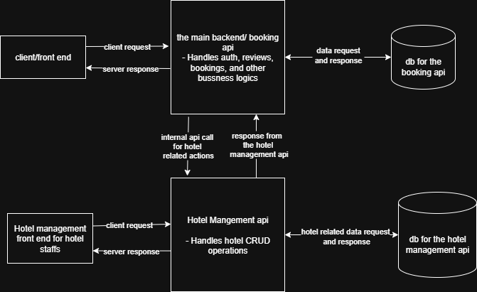

# System Architecture – GuzoMate Platform

## Overview

The GuzoMate platform follows a **three-tier architecture** enhanced with a **microservice integration** model. The main backend (Django) handles user-related features and communicates via HTTP with a separate internal Hotel Management API for hotel-related data.

---

## Architecture Diagram

## Components

### 1. **Frontend (React.js)**

- **Role**: Presentation Layer
- **Responsibilities**:
  - Allow users to browse, search, and review hotels
  - Support user authentication and booking
  - Display hotel availability and details (fetched indirectly from Hotel API via main backend)
- **API Calls**: Communicates **only** with the main backend

### 2. **Main Backend (Django + DRF)**

- **Role**: Logic Layer
- **Responsibilities**:
  - Expose REST API for frontend
  - Handle user authentication, bookings, reviews, search features, and other business logics.
  - Make internal HTTP requests to the Hotel Management API for hotel-related data
- **Security**:
  - JWT/simplJWT Auth for users
  - Secure internal HTTP communication with Hotel API

---

### 3. **Hotel Management API (Django Service)**

- **Role**: Internal Microservice
- **Responsibilities**:
  - Create, read, update, delete hotel and room data
  - Manage hotel availability
  - Manage hotel owners and their dashboards
- **Consumes**: Internal HTTP requests from the main backend
- **Does Not Expose** endpoints to the frontend directly but it exposes endpoints for hotel staffs for in person tasks

---

### 4. **Databases**

- **Main Backend Database (PostgreSQL)**:
  - Stores user profiles, reviews, booking_history, preferences, hotels, city related data and etc.

- **Hotel API Database (PostgreSQL)**:
  - Stores hotel details, bookings, rooms, availability, and owner data

- The plan is to isolate databases but depending on the complication it creates on deployment that can be amended.

---

## API Interaction Flow

### User Flow Example: Hotel Search and Booking

1. User performs hotel search on the frontend
2. React sends request to: `GET /api/hotels/`
3. Main backend forwards the request to the Hotel API: `GET /internal-api/hotels/`
4. Hotel API returns hotel listings
5. Main backend processes and returns data to frontend
6. If user books a hotel:
   - Booking is saved in the **hotel management backend DB** and its summary record is saved in **Main backend DB** for user history
   - Hotel availability is updated in the **Hotel API DB**

---

## Security Considerations

- Use HTTPS for secure transport
- Protect internal API communication via service tokens or API keys
- Sanitize all user inputs
- CORS only enabled for frontend domains
- Use Role-Based Access Control for hotel owners

---

## Scalability Notes

- Hotel API can be scaled independently from the main backend
- In the future, other services like:
  - Recommendation engine
  - Payment gateway
  - Notification service
  can be added as separate microservices

---

## Conclusion

This modular architecture ensures flexibility, scalability, and clear separation of concerns. It supports current needs (hotel listing, rating, booking) and future growth (AI, mobile apps, 3rd-party integration)

---

© 2025 GuzoMate Project Team